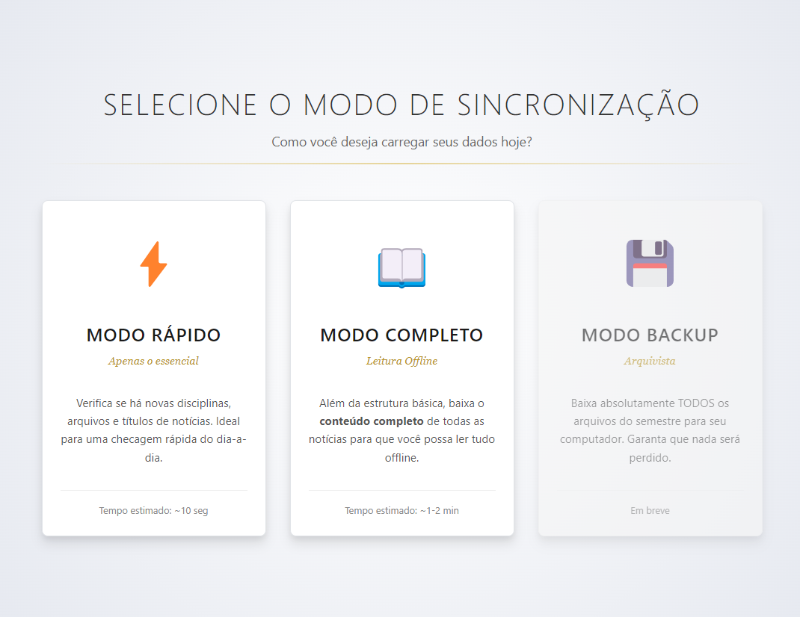
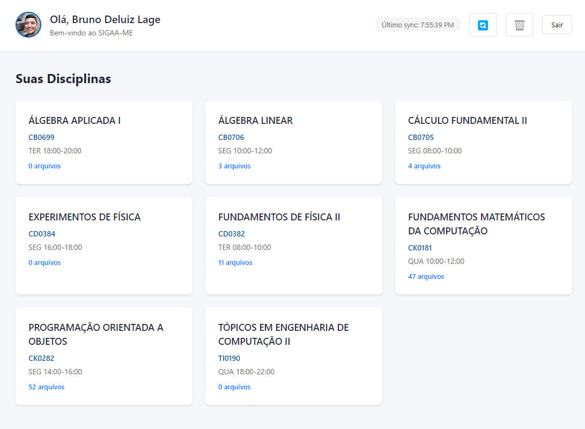
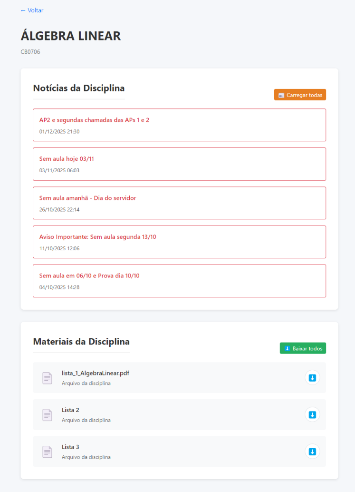

# SIGAA-ME

Desktop app for UFC's SIGAA, which aims to provide a better experience than the official website on specific, student-friendly, functionalities.


---

## ✨ What it does

- Logs into SIGAA using your UFC credentials (stored securely)
- Syncs your active courses, files, and news
- Caches everything locally for **offline reading**
- Downloads files in bulk, automatically
- Keeps a persistent session so you don't have to log in every time

---

## 📥 Installation

> **Requires:** [Google Chrome](https://www.google.com/chrome/) installed on your machine.

1. Go to the [**Releases**](https://github.com/Laginho/SIGAA-ME/releases) page.
2. Download the latest `SIGAA-ME-Windows-X.X.X-Setup.exe` file.
3. Run the installer.
4. If Windows shows a "Windows protected your PC" warning, click **"More info"** → **"Run anyway"**. This is expected for apps that aren't yet signed with a paid certificate.
5. The app will open. Enter your UFC SIGAA credentials and you're done.

> The app will **automatically update** in the background when a new version is released.

---

## 📸 Screenshots





---

## ⚠️ Known Limitations

- Currently only works with UFC's SIGAA instance (`si3.ufc.br`)
- The initial sync is slow, because it has to mimic a real user navigating the site
- Some files may fail to download if SIGAA's session expires mid-sync

---

## 🛠️ Running Locally (for developers)

**Prerequisites:** Node.js, npm, Google Chrome

```bash
git clone https://github.com/Laginho/SIGAA-ME.git
cd SIGAA-ME
npm install
npm run dev
```

### Running Tests

```bash
# Unit tests only (no credentials needed, runs in ~1s)
npx vitest run tests/unit

# All tests including live SIGAA integration (requires .env)
cp .env.example .env   # then fill in your credentials
npm test
```

---

## 🏗️ Tech Stack

| Layer | Technology |
|---|---|
| UI | Vanilla TypeScript + Vite |
| Backend | Electron (Node.js) |
| Scraping | Playwright (Chrome) + Axios |
| Storage | SQLite + localStorage |
| Build | electron-builder |
| CI/CD | GitHub Actions |

See [ARCHITECTURE.md](ARCHITECTURE.md) for a detailed breakdown of the Playwright/HTTP hybrid approach.

---

## 🗺️ Roadmap

See [ROADMAP.md](ROADMAP.md).

---

## 🐛 Found a bug?

Open an [issue](https://github.com/Laginho/SIGAA-ME/issues) describing what happened, what you expected, and (if possible) a screenshot.

---

## 📄 License

MIT — see [LICENSE](LICENSE).
