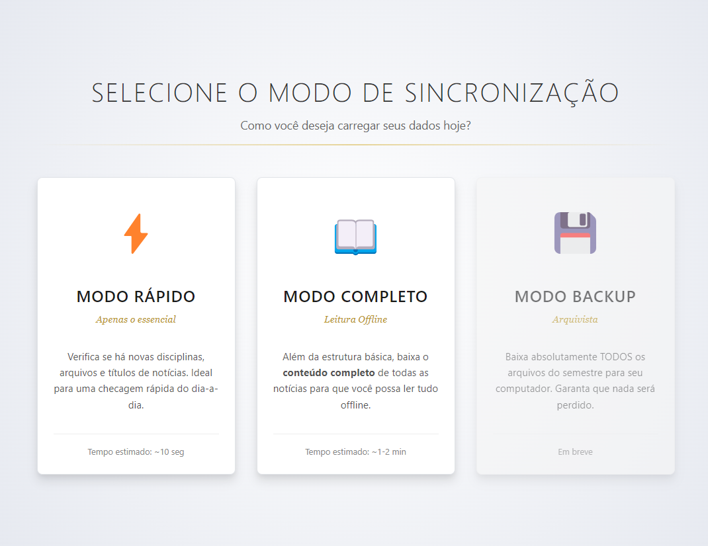
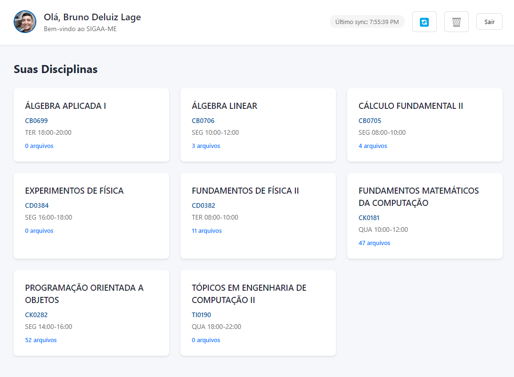
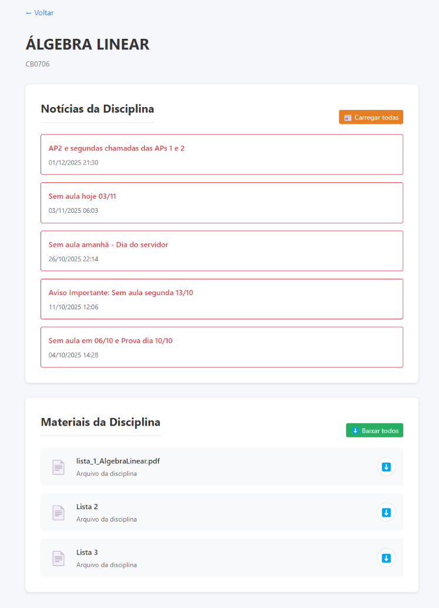

# SIGAA-ME

Aplicativo desktop para o SIGAA da UFC, que visa proporcionar uma experiência melhor do que o site oficial em funcionalidades específicas e amigáveis para o estudante.


---

## ✨ O que ele faz

- Faz login no SIGAA usando suas credenciais da UFC (armazenadas com segurança)
- Sincroniza suas disciplinas ativas, arquivos e notícias
- Armazena tudo localmente para **leitura offline**
- Baixa arquivos em lote, automaticamente
- Mantém uma sessão persistente para que você não precise fazer login toda vez

---

## 📥 Instalação

> **Requisito:** Ter o [Google Chrome](https://www.google.com/chrome/) instalado na sua máquina.

1. Vá para a página de [**Releases**](https://github.com/Laginho/SIGAA-ME/releases).
2. Baixe o arquivo mais recente `SIGAA-ME-Windows-X.X.X-Setup.exe`.
3. Execute o instalador.
4. O Windows vai mostrar o aviso "O Windows protegeu seu computador" — isso
   acontece porque o app não tem certificado pago, não porque há algo errado.
   Antes de continuar, confira o arquivo como a seção **🔐 Verificando o
   download** (logo abaixo) explica. Depois, clique em **"Mais informações"**
   → **"Executar assim mesmo"**.
5. O app abrirá. Insira suas credenciais do SIGAA UFC e pronto.

> O app confere se há uma nova versão a cada abertura, mas nunca baixa ou
> instala nada sem perguntar: ele avisa a versão disponível e pede
> confirmação antes de baixar, e pede confirmação de novo antes de reiniciar
> para instalar.

---

## 🔐 Verificando o download

O instalador sai do GitHub Actions, com log público apontando o commit. Confira o hash antes de instalar:

```powershell
Get-FileHash .\SIGAA-ME-Windows-X.X.X-Setup.exe -Algorithm SHA256
```

Compare com a linha correspondente em `SHA256SUMS.txt`, publicado junto na release. Opcional: `gh attestation verify .\SIGAA-ME-Windows-X.X.X-Setup.exe --owner Laginho` confirma a proveniência.

---

## 📸 Prints





---

## ⚠️ Limitações Conhecidas

- Atualmente funciona apenas com a instância do SIGAA da UFC (`si3.ufc.br`)
- A sincronização inicial é lenta, pois precisa imitar um usuário real navegando no site
- Alguns arquivos podem falhar no download se a sessão do SIGAA expirar durante a sincronização

---

## 🛠️ Rodando Localmente (Para Desenvolvedores)

**Pré-requisitos:** Node.js, npm, Google Chrome

```bash
git clone https://github.com/Laginho/SIGAA-ME.git
cd SIGAA-ME
npm install
npm run dev
```

### Rodando os Testes

```bash
# Apenas testes unitários (sem credenciais, roda em ~1s)
npx vitest run tests/unit

# Todos os testes, incluindo integração real com o SIGAA (requer .env)
cp .env.example .env   # depois preencha suas credenciais
npm test
```

---

## 🏗️ Tecnologias Utilizadas

| Camada | Tecnologia |
|---|---|
| UI | Vanilla TypeScript + Vite |
| Backend | Electron (Node.js) |
| Scraping | Playwright (Chrome) + Axios |
| Armazenamento | SQLite + localStorage |
| Build | electron-builder |
| CI/CD | GitHub Actions |

Veja o [ARCHITECTURE.md](ARCHITECTURE.md) para um detalhamento da abordagem híbrida Playwright/HTTP.

---

## 🗺️ Roadmap

Veja o [ROADMAP.md](ROADMAP.md).

---

## 🐛 Encontrou um bug?

Abra uma [issue](https://github.com/Laginho/SIGAA-ME/issues) descrevendo o que aconteceu, o que você esperava e (se possível) um print.

---

## 📄 Licença

MIT — veja [LICENSE](LICENSE).
